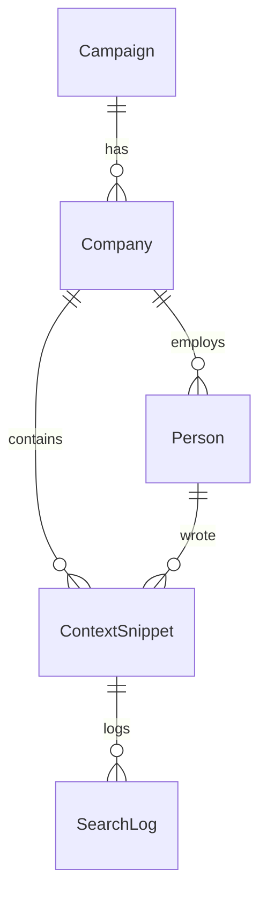

# 🔍 Alpha Platform — Research Agent System

A fully-runnable vertical slice demonstrating an async research agent pipeline that models campaigns, companies, and people, and uses SerpAPI to enrich data with structured insights.

---

## 📦 Quick Start

### 🔧 Prerequisites

- Docker + Docker Compose
- Python 3.11+ (for tests)
- Node.js (for frontend dev)

### 🚀 Spin Up Everything

```bash
cp .env.example .env
docker-compose up --build
```

This sets up:

- PostgreSQL
- Redis
- Celery worker
- FastAPI backend (with Swagger docs)
- Vite + React frontend

---

## 🛠️ Detailed Setup Guide

You can run this project either with Docker or in your local environment.

### 🔐 Environment Variables

| Variable              | Required | Description                                   | Example                                                               |
|-----------------------|----------|-----------------------------------------------|-----------------------------------------------------------------------|
| `DATABASE_URL`        | ✅ Yes   | PostgreSQL connection string                  | `postgresql://alphauser:alphapass@db:5432/alphadb`                    |
| `CELERY_BROKER_URL`   | ✅ Yes   | Celery broker for background jobs             | `redis://redis:6379/0`                                                |
| `CELERY_RESULT_BACKEND`| ✅ Yes  | Where Celery stores task results              | `redis://redis:6379/1`                                                |
| `SERP_API_KEY`        | ✅ Yes   | API key for SerpAPI                           | `your-serpapi-key`                                                    |
| `AUTO_SEED`           | ❌ No    | If true, seeds DB with sample data on startup | `true`                                                                |

> 📌 Tip: Copy `.env.example` to `.env` and replace sensitive values.


### 🐳 Docker-based Setup

#### 1. Create `.env` at root:

```bash
touch .env
```

#### 2. Run the application stack:

```bash
docker-compose up --build
```

- This will:

  - Launch the FastAPI backend (backend)

  - Start a Celery worker (celery_worker)

  - Launch Redis (used for real-time progress tracking)

#### 3. Run the front end locally (docker support for react will be integrated later):

```bash
  npm run dev
```

- Why setup react locally?
  - The support for react in docker is there but there are defects with network bindings.
  - `docker-compose.yml` has the capability to run the react image, it's just commented out because port `5173` gets blocked.

#### 4. Access the platform:

- Frontend: http://localhost:3000

- API endpoints: http://localhost:8000/api/healthz

### 🧪 Local Dev Setup (without Docker)

#### 1. Clone the repo and install dependencies:

```bash
cd backend
python -m venv venv && source venv/bin/activate
pip install -r requirements.txt
```

```bash
cd ../frontend
yarn install
```

#### 2. Start services:

- Redis (locally via Docker or system):

```bash
docker run -p 6379:6379 redis
```

- Backend

```bash
cd backend
uvicorn app.main:app --reload
```

- Celery Worker:

```bash
celery -A app.workers.task worker --loglevel=info
```

- Frontend:

```bash
cd frontend
yarn dev
```


## 🧪 Seed, Unseed, and Reset

> Dev-only utilities are available as buttons on the UI homepage or via API:

- `POST /dev/seed` — Seed DB with 1 campaign, 1 company, 2 people
- `POST /dev/unseed` — Delete seeded rows
- `POST /dev/unenrich` — Delete research outputs (snippets + logs)

---

## 🔁 End-to-End Flow

### 1. View People

Go to the home page or call:

```bash
curl http://localhost:8000/people
```

### 2. Trigger Enrichment

From the UI: Click “🔍 Enrich” for any person.  
Or via API:

```bash
curl -X POST http://localhost:8000/enrich/<person_id>
```

Returns a `task_id` used to track progress.

---

### 3. Track Progress (WebSocket)

Real-time progress is streamed over WebSocket:

```js
ws://localhost:8000/ws/progress/<task_id>
```

Client UI uses this to render a progress bar live.

---

### 4. View Enriched Results

After job finishes, results appear under the person’s company.

Or, call:

```bash
curl http://localhost:8000/snippets/<company_id>
```

---

## 🧠 Deep Research Agent

### Modes

Agent can run in two modes:

- **Mock** (deterministic JSON, used for local dev)
- **SerpAPI** (real Google-like results)

Controlled via `.env`:

```env
AGENT_MODE=serpapi
SERP_API_KEY=your-key-here
```

### Fields Extracted

The agent searches and extracts:

- `company_value_prop`
- `product_names`
- `pricing_model`
- `key_competitors`
- `company_domain` (redundant)

### Replanning Logic

- If any required field is missing, another query is attempted (max 3 tries).
- Top 3 links per query are stored for traceability.

---

## 🧪 Testing

### 🔹 Unit Tests

```bash
pytest tests/unit/
```

Covers:

- JSON Schema validation for snippets
- Email → domain parsing
- Agent replan edge case

### 🔸 Integration Tests

```bash
pytest tests/integration/
```

Covers:

- Enrich job full flow
- WebSocket progress stream
- DB snippet persistence

---

## 🧰 Tech Stack

- **Backend**: FastAPI + Celery + Redis + SQLAlchemy
- **Frontend**: React + Vite + Tailwind
- **Queue**: Celery with Redis broker
- **Infra**: Docker Compose
- **Search API**: SerpAPI (pluggable)

---

## 🧩 ER Diagram



---

## 📈 Observability

- Console logs include: `person_id`, `iteration`, `query`
- `/healthz` endpoint returns 200 OK for health checks

---

## 🔄 Future Work

- [ ] Support multiple agents (e.g., LinkedIn extractor)
- [ ] Admin-auth UI to manage campaigns
- [ ] Advanced deduplication in SerpAPI agent
- [ ] Prometheus + Grafana metrics
- [ ] Field-level confidence scores for research agent

---

## 📬 Postman Collection

✅ Included:

- `GET /people`
- `POST /enrich/{person_id}`
- `GET /snippets/{company_id}`

---

## 🎥 Demo Video

Included as `demo.mp4` or available via Loom link.

---

## ✅ Done Criteria Summary

| Item                             | Status |
| -------------------------------- | ------ |
| Seed Campaign > Company > People | ✅     |
| Async Agent (mock + real)        | ✅     |
| WS-based live progress           | ✅     |
| UI: Enrich + Card view           | ✅     |
| DB persistence (snippets/logs)   | ✅     |
| Tests (unit + integration)       | ✅     |
| Postman Collection               | ✅     |
| ERD Diagram                      | ✅     |
| Dockerized & self-contained      | ✅     |
